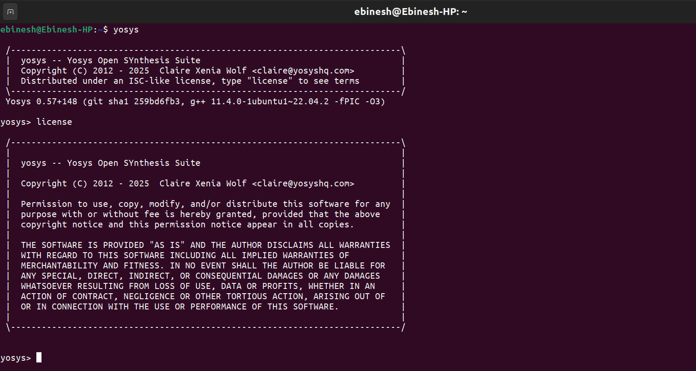
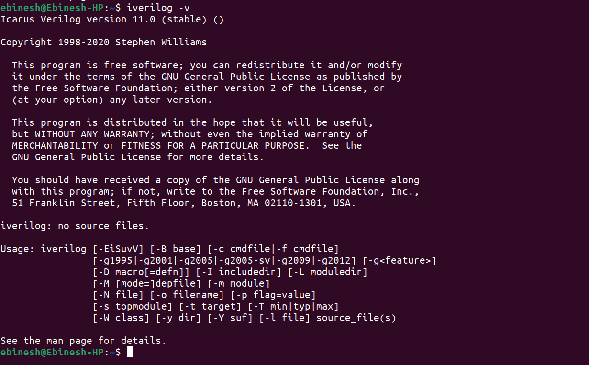
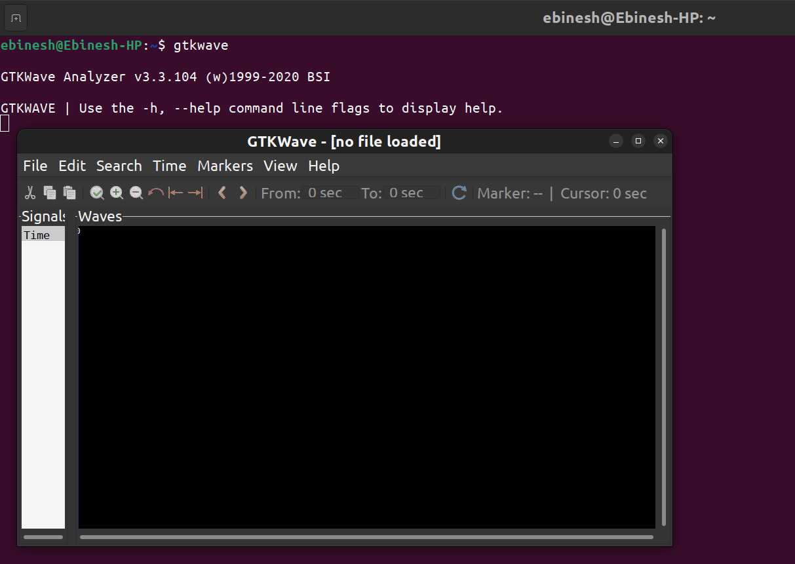
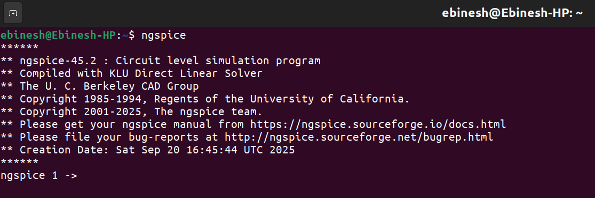
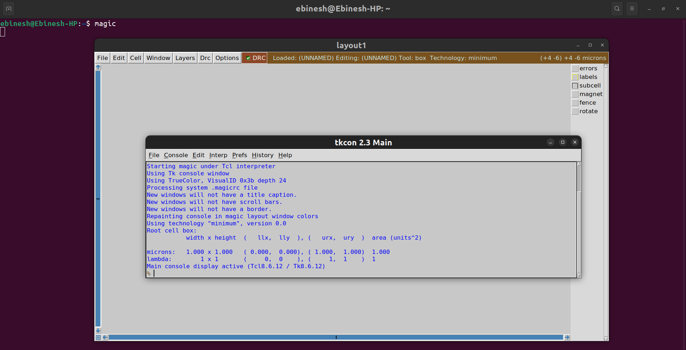
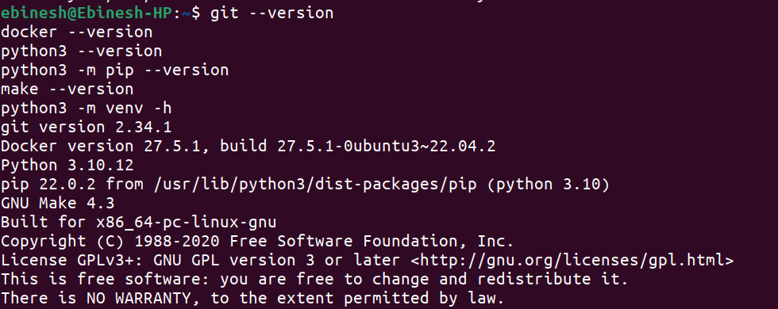

# RISC-V Reference SoC Tapeout Program VSD

## Tools Installation

#### <ins>All the instructions for installation of required tools can be found here:</ins>

### **System Requirements**
- 6 GB RAM
- 50 GB HDD
- Ubuntu 20.04 or higher
- 4 vCPU


#### <ins>**Yosys**</ins>
```bash
$ sudo apt-get update
$ git clone https://github.com/YosysHQ/yosys.git
$ cd yosys
$ sudo apt install make               # If make is not installed
$ sudo apt-get install build-essential clang bison flex \
    libreadline-dev gawk tcl-dev libffi-dev git \
    graphviz xdot pkg-config python3 libboost-system-dev \
    libboost-python-dev libboost-filesystem-dev zlib1g-dev
$ make config-gcc
# Yosys build depends on a Git submodule called abc, which hasn't been initialized yet. You need to run the following command before running make
$ git submodule update --init --recursive
$ make 
$ sudo make install
```


#### <ins>**Iverilog**</ins>
```bash
$ sudo apt-get update
$ sudo apt-get install iverilog
```


#### <ins>**gtkwave**</ins>
```bash
$ sudo apt-get update
$ sudo apt install gtkwave
```


#### <ins>**NGspice**</ins>
```bash
After downloading the tarball from https://sourceforge.net/projects/ngspice/files/ to a local
directory, unpack it using:
$ tar -zxvf ngspice-45.2.tar.gz
$ cd ngspice-45.2
$ mkdir release
$ cd release
$ ../configure --with-x --with-readline=yes --disable-debug
$ make
$ sudo make install
```


#### <ins>**Magic VLSI**</ins>
```bash
$ sudo apt-get install m4
$ sudo apt-get install tcsh
$ sudo apt-get install csh
$ sudo apt-get install libx11-dev
$ sudo apt-get install tcl-dev tk-dev
$ sudo apt-get install libcairo2-dev
$ sudo apt-get install mesa-common-dev libglu1-mesa-dev
$ sudo apt-get install libncurses-dev
git clone https://github.com/RTimothyEdwards/magic
cd magic
./configure
make
sudo make install
```


## **Check Tool Versions**

```bash
# Check versions of essential tools
$ git --version
$ docker --version
$ python3 --version
$ python3 -m pip --version
$ make --version
```

<p align="center">
  
</p>

<div align="center">
  ✅ <b>All Tool Versions Verified</b>
</div>

<div align="center">

## 🎉 **Installation Summary**

| Tool | Status | Primary Use |
|------|--------|-------------|
| 🧠 **Yosys** | ✅ Complete | RTL Synthesis |
| 📟 **Iverilog** | ✅ Complete | Verilog Simulation |
| 📊 **GTKWave** | ✅ Complete | Waveform Analysis |
| ⚡ **NGSpice** | ✅ Complete | Circuit Simulation |
| 🎨 **Magic VLSI** | ✅ Complete | Layout Design |
| 🛠️ **Tool Versions** | ✅ Verified | Environment Check |

### 🚀 **Environment Ready for VLSI Design Journey!**

</div>

---

<div align="center">

**📂 Repository:** [from rlt to silicon](https://github.com/Ebiinesh/from-rtl-to-silicon) 
**👨‍💻 Author:** [Ebinesh K](https://github.com/Ebiinesh))
**📚 Program:** VLSI System Design (VSD)


</div>
